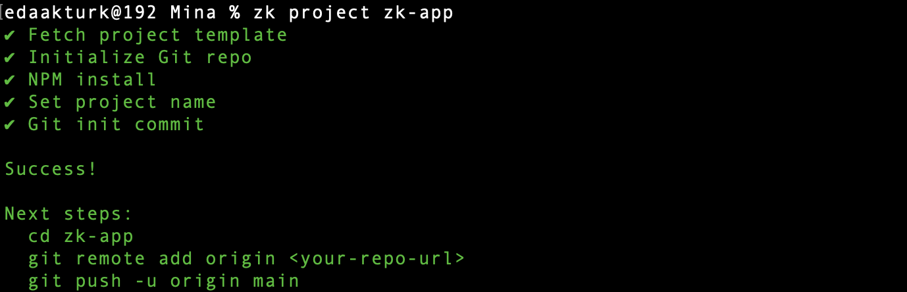
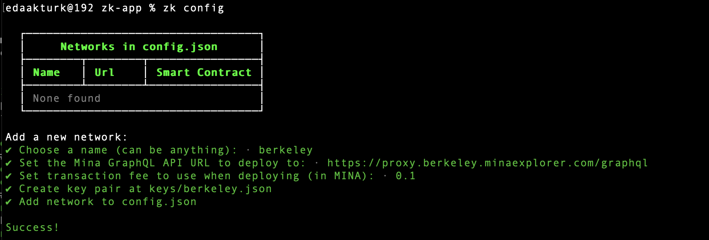
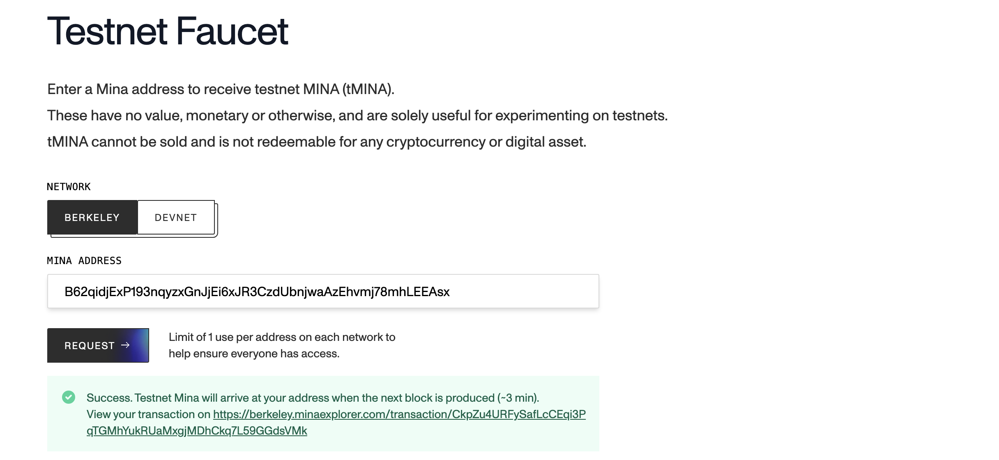
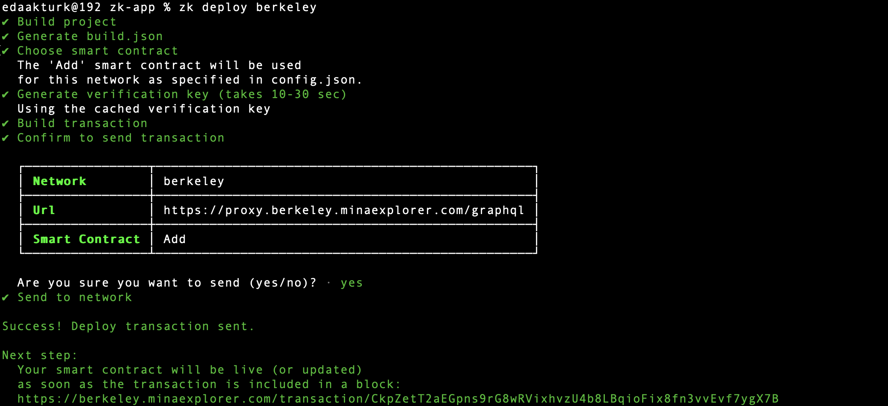

# Zk Tutorial for building on Mina Protocol

A simple overview of creating & deploying a zkApp on Mina Protocol.

## Create & Deploy a zkApp on Mina Protocol

1. Create a new project folder

    ```
    zk project zk-app
    ```

    

    Here's how the project folder looks like:

    ```
    .
    ├── build
    ├── keys
    ├── node_modules
    ├── src
    ├── LICENSE
    ├── README.md
    ├── babel.config.cjs
    ├── config.json
    ├── jest-resolver.cjs
    ├── jest.config.js
    ├── package-lock.json
    ├── package.json
    └── tsconfig.json
    ```

    Let's look into the src folder that contains the smart contracts for the zkApp.

2. We need to add the project configurations, run the command below to get the configuration wizard.

    ```
    zk config
    ```
    Add the details below:

    - Name: *berkeley*
    - URL: *https://proxy.berkeley.minaexplorer.com/graphql*
    - Fee: *0.1*

    

3. Get Testnet Tokens(tMINA) by following the link on the pervious terminal. It takes a few min.

    

    *Testnet tokens are required to pay for the transaction to deploy the smart contract to the blockchain.*

4. Deploy the app to the Mina Berkeley Testnet. Make sure you have your tMina in your account.

    ```
    zk deploy berkeley
    ```
    

🎉 There you go! You've deployed your smart contracts onto the Mina Blockchain testnet.
