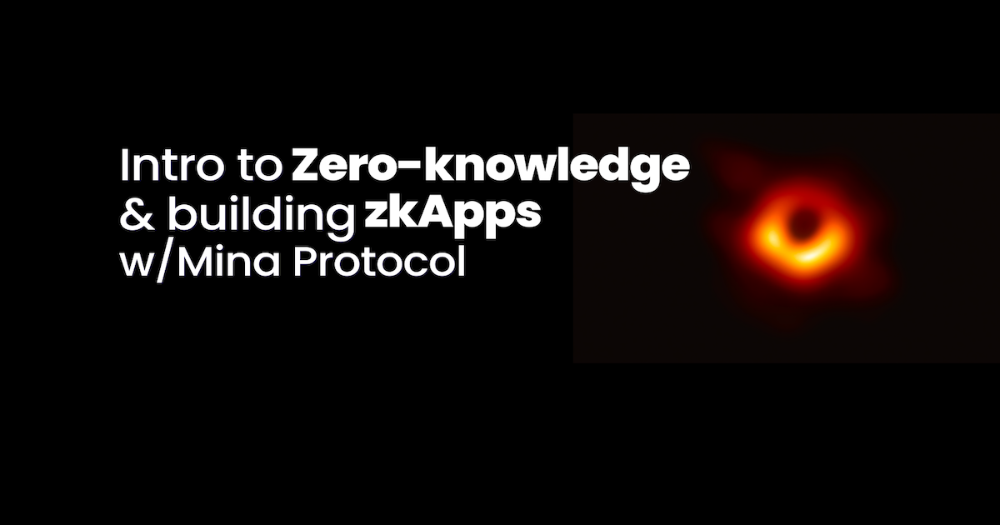

# Getting started building on Mina Protocol



This is the repo to go along with the blog post [Intro to Zero-knowledge & building zkApps w/Mina Protocol](https://eda.hashnode.dev/zero-knowledge-building-zkapps-mina-protocol)

---

## Getting started

This is an example of how to create & deploy a zkApp with Mina zkApp CLI to the Mina Testnet.

*I'd highly recommend checking out [Mina Docs](https://docs.minaprotocol.com/zkapps) for deeper dive and more examples. Also, here's a great presentation from [Jack](https://twitter.com/jackservia) on building [Mina zkApps](https://www.youtube.com/watch?v=kqjPwPV7qMA&ab_channel=ETHGlobal).*

### Tools

- NodeJS 16+
- [Mina zkApp CLI](https://www.npmjs.com/package/zkapp-cli): package for creating zkApps using [SnarkyJS](https://docs.minaprotocol.com/zkapps/snarkyjs-reference) which is the Typescript Framework for writing zkApps on Mina Protocol. Test framework, formatting, git and other tools are also included in the NPM package
- Berkeley Testnet: where the app will be deployed to (at the time of writing this post, zkApps are not yet available on Mina Mainnet)
- [Mina Block Explorer for Berkeley](https://berkeley.minaexplorer.com/)

### Installation

1. First, make sure you have a [NodeJS](https://nodejs.org/en/) version 16 or above.
    You can check the Node version by:
    ```node -v``` or ```node --version```

2. Install the zkApp package manager
    ```npm install -g zkapp-cli```

    You can check that you’ve installed by running:
    ```zk —version```

3. *Optional* Setup a Mina wallet

    *This section is not required for the tutorial however I am adding it here because it's important to have the tools to interact with the blockchain, and that's where we need a crypto wallet.*

    I've set up [Auro](https://www.aurowallet.com/), thats a wallet for Mina Protocol. It comes as a browser extension and mobile app.

    After you add the extension to your browser, you can follow the steps to create an account. It will generate a mnemonic phrase and make sure to store this phrase safely. Once your account is created, you'll see the account information on the UI.

### Create & Deploy a zkApp on Mina Protocol

1. Create a new project folder

    ```
    zk project zk-app
    ```

    Here's what the project folder looks like:

    ```
    .
    ├── build
    ├── keys
    ├── node_modules
    ├── src
    ├── LICENSE
    ├── README.md
    ├── babel.config.cjs
    ├── config.json
    ├── jest-resolver.cjs
    ├── jest.config.js
    ├── package-lock.json
    ├── package.json
    └── tsconfig.json
    ```

    The src folder that contains the smart contracts for the zkApp. You'll see: Add.ts and Add.test.ts. These are the zk-smart contract and the test file.

    I have added the code and some comments to explain what's going on:

    ```
    import {
      Field, // Field is used to describe unsigned integers
      SmartContract, // class for zk app smart contracts
      state,
      State,
      method,
      DeployArgs,
      Permissions,
    } from 'snarkyjs';

    /**
     * The Add contract initializes the state variable 'num' to be a Field(1) when deployed.
     * The Add contract adds Field(2) to 'num' when the update() func is called.
     **/

    export class Add extends SmartContract {

      @state(Field) num = State<Field>(); // creates an on-chain state called num

      deploy(args: DeployArgs) { // deploy method, describes the settings and permissions
        super.deploy(args);
        this.setPermissions({
          ...Permissions.default(),
          editState: Permissions.proofOrSignature(),
          // Proof authorization: allows end users to change the zkApp account state
          // Signature authorization: allows the deployer account
        });
      },

      // @method decorator means that the func can be revoked by end-users
      @method init() { // initialize the num value to Field(1) on deployment
        this.num.set(Field(1));
      }

      @method update() { // function to update the on-chain state of num variable(state)
        const currentState = this.num.get(); // get the on-chain state
        this.num.assertEquals(currentState); // check this.num.get() is equal to the actual on-chain state
        const newState = currentState.add(2); // add 2
        newState.assertEquals(currentState.add(2)); // the assertion must be true to create the zk-proof
        this.num.set(newState); // set the new on-chain state
      }
    }
    ```

    An important recap on how the app works is that the execution is done on the client side (browser). You can have public variables on the contract, in this example ```num``` is a on-chain value. In another case, you can pass private data into the contract, which is turned into a zk-prood on the browser and isn't seen by the network.

2. We need to add the project configurations, run the command below to get the configuration wizard.

    ```
    zk config
    ```
    Add the details below:

    - Name: *berkeley-app*
    - URL: *https://proxy.berkeley.minaexplorer.com/graphql*
    - Fee: *0.1*

3. Get Testnet Tokens(tMINA) by following the link on the pervious terminal. It takes a few min.

    *Testnet tokens are required to pay for the transaction to deploy the smart contract to the blockchain.*

4. Deploy the app to the Mina Berkeley Testnet. Make sure you have your tMina in your account.

    ```
    zk deploy berkeley-app
    ```

 🎉 Wohoo! You've deployed your smart contracts onto the Mina Berkeley Testnet.

5. Lets create a small sript to interact with our contract locally. I've created ```src/main.ts``` and added code below. I've added comments to explain whats going on.

    ```
    import { Add } from './Add.js';
    import {
      isReady,
      shutdown,
      Mina,
      PrivateKey,
      AccountUpdate,
    } from 'snarkyjs';

    (async function main() {
      await isReady;
      console.log("Starting");

      // start a local blockchain
      const Local = Mina.LocalBlockchain();
      Mina.setActiveInstance(Local);
      const deployerAccount = Local.testAccounts[0].privateKey;

      // create a destination to deploy the smart contract
      const zkAppPrivateKey = PrivateKey.random();
      const zkAppAddress = zkAppPrivateKey.toPublicKey();

      // create an instance of Add - and deploy it to zkAppAddress
      const zkAppInstance = new Add(zkAppAddress);
      const deploy_txn = await Mina.transaction(deployerAccount, () => {
        AccountUpdate.fundNewAccount(deployerAccount);
        zkAppInstance.deploy({ zkappKey: zkAppPrivateKey });
        zkAppInstance.init();
        zkAppInstance.sign(zkAppPrivateKey);
      });
      await deploy_txn.send().wait();

      // get the initial state of Add after deployment
      const num0 = zkAppInstance.num.get();
      console.log('Num after init:', num0.toString());

      // ----------------------------------------------------

      const txn1 = await Mina.transaction(deployerAccount, () => {
        zkAppInstance.update();
        zkAppInstance.sign(zkAppPrivateKey);
      });
      await txn1.send().wait();

      const num1 = zkAppInstance.num.get();
      console.log('Add 2:', num1.toString());

      // ----------------------------------------------------

      try {
        const txn2 = await Mina.transaction(deployerAccount, () => {
          zkAppInstance.update();
          zkAppInstance.sign(zkAppPrivateKey);
        });
        await txn2.send().wait();
      } catch (ex: any) {
        console.log(ex.message);
      }
      const num2 = zkAppInstance.num.get();
      console.log('Add 2:', num2.toString());

      // ----------------------------------------------------

      const txn3 = await Mina.transaction(deployerAccount, () => {
        zkAppInstance.update();
        zkAppInstance.sign(zkAppPrivateKey);
      });
      await txn3.send().wait();

      const num3 = zkAppInstance.num.get();
      console.log('Add 2:', num3.toString());

      // ----------------------------------------------------

      console.log('Closing the local blockchain');
      await shutdown();

    })();

    ```

6. Run the commands below to compile and run the zkapp:
    ```
    npm run build
    node build/src/main.js
    ```

    If all goes well, you should be able to see the results on the terminal.

    *To use your zk-app on production, you need to publish your file to npm. Once you create an npm package, you can import it to your front-end. You can find the steps [here](https://docs.minaprotocol.com/zkapps/how-to-write-a-zkapp-ui#publish-to-npm-for-production).*

#### Testing

The JavaScript Testing Framework, [Jest](https://jestjs.io/) is included in the Mina zkApp CLI.

- You can find the test file for the starter project in: Add.test.ts
- Run tests with: ```npm run test``` or ```npm run testw``` (for watch mode)
- Run ```npm run coverage``` to generate a coverage report which shows which % of your code is covered with test. Here's how the [coverage folder](https://github.com/edakturk14/zk-tutorial/tree/main/zk-app/coverage) is for our sample project.
- You can run your tests locally [here's](https://docs.minaprotocol.com/zkapps/how-to-test-a-zkapp#creating-a-local-blockchain) more details on creating a local blockchain

*Please note: Jest just comes with the project, and you can use another test framework if you'd like to.*
